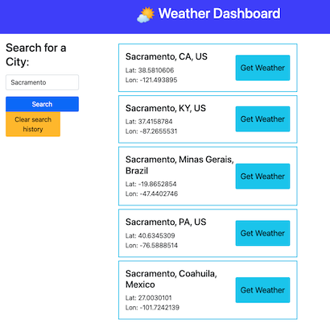

# Weather Dashboard

## Description

This is a web application that shows today's weather, in addition to the forecaset for next 5 days.

## Installation

Simply open [benjstorlie.github.io/weather-dashboard/](https://benjstorlie.github.io/weather-dashboard/) and enter the name of the city you want to find the weather for.

## Features

1. When you search for a city, you will get the top five cities with that name in the world.

2. You are shown the name of the city's country, and, for US cities, the 2-character postal code for its state.

3. If there is only one city with that name, you skip right to the forecast.

1. Your search history is saved, so you can go back to different cities' forecasts, without needing to look through the search results.

4. You are shown today's weather card large at the top, and the next five days in smaller cards all of the same size.  Each card shows the date, and an icon illustrating the weather for that day.

6. The website is responsive to screen width, so you are always able to read each card's forecast data.  Sometimes the icon is on the top, sometimes to the left, depending on the size.

## User Story

```
AS A traveler
I WANT to see the weather outlook for multiple cities
SO THAT I can plan a trip accordingly
```

## Acceptance Criteria

```
GIVEN a weather dashboard with form inputs
WHEN I search for a city
THEN I am presented with current and future conditions for that city and that city is added to the search history
WHEN I view current weather conditions for that city
THEN I am presented with the city name, the date, an icon representation of weather conditions, the temperature, the humidity, and the wind speed
WHEN I view future weather conditions for that city
THEN I am presented with a 5-day forecast that displays the date, an icon representation of weather conditions, the temperature, the wind speed, and the humidity
WHEN I click on a city in the search history
THEN I am again presented with current and future conditions for that city
```

## Screenshots

This is how the main forecast page looks on a desktop.


This is how the forecast page is adjusted for mobile view.


This is the list of search results when there is more than one city with that name.



## Comments and Future Plans

1. Now I understand that local storage is for the whole browser and not just single websites or webpages, since I found data from my previous projects in there.  I wonder if there is a standard or preferred way to mark which data came from your site, to make retrieval easier and to not overwrite something else by accident.

1. Currently, the JavaScript file creates whole new elements.  I think I would like to restructure it so that more is set up in the HTML.  Not-in-use containers would be set to `display: none`, and the JavaScript file would then fill in with text the empty elements.  I think that would make styling much easier to read and edit, since I'm doing most of it by adding Bootstrap classes.

  * If I do this, it will be much easier to fix the styling and layout, because right now it's difficult to do that.

2. I would like you to also be able to enter a zip code in addition to a city name.  I would have it see if your input is formatted like a zip code, and then use that function of the Geocoding API.

  * It would be easy to add a feature where you can just enter latitude and longitude.  Right now, if you put only the latitude and longitude in the url query, you do get the weather for that location, but it shows the name of the city as "undefined, undefined".

3. The Geocoding API returns these two-character country codes.  I did some fiddling to turn a table of these codes into an object to look up country names by their codes. Similarly, it returns the whole state name instead of the two-character code, which looks clunky.  So I made another list to clean up how the location is formatted.

3. The weather icons are all on a sky blue background, which looks silly when it is nighttime and it's showing the night versions of the icons. I like having the sky background color, but there needs to be some more conditional formatting to look less silly.  It would even be nice to adjust the color to the weather, too — i.e. lighter blue for sunny, darker blue for cloudy or rainy.

4. My mother uses this app called Drive Weather to plan out road trips.  It seems like it wouldn't be too much of a change to have the user input different cities and dates to show how the weather will change on your trip.